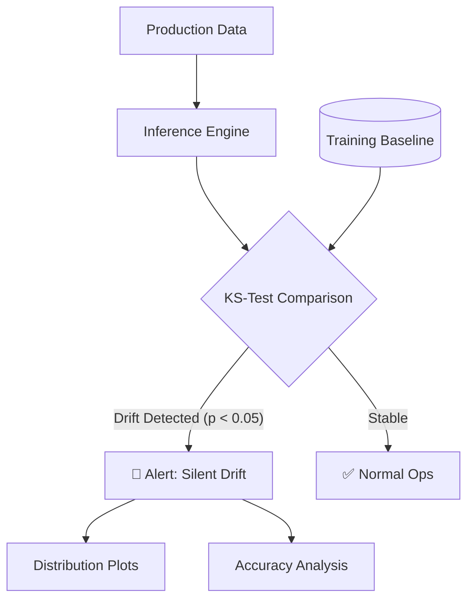

<div align="center">
  
  <h1>AI Model Drift Monitor (AMDM)</h1>
  <p><b>Detecting, Quantifying, and Visualizing Silent Performance Degradation in Production.</b></p>
  
  [](https://www.python.org/)
  [](https://scikit-learn.org/)
  [](https://scipy.org/)
  [](https://github.com/jenaarmaan)
  
  <br/>

  **[WALKTHROUGH](file:///C:/Users/armaa/.gemini/antigravity/brain/50ecedb1-8ca6-4a81-8a70-46f456eb2fc2/walkthrough.md)** — *See the drift in action!*
</div>

---

## 📖 Introduction

In the lifecycle of an AI system, deployment is just the beginning. Real-world data is fluid, and models optimized for static datasets inevitably face **Silent Model Drift**. AMDM is a specialized monitoring prototype designed to identify when production data diverges from training data before performance collapses.

> "A model is only as good as the data it sees today, not the data it saw yesterday."

## ✨ Core Capabilities

### 🧪 Phase 1: Robust Data Simulation
Simulate realistic "Loan Approval" scenarios, including a high-impact **Market Recession** event where feature distributions (Income, Debt Ratio) shift radically from training baselines.

### 🔍 Phase 2: Statistical Drift Detection
Beyond simple heuristics. AMDM implements the **Kolmogorov-Smirnov (KS) Test** to mathematically prove when the distribution of production features has significantly diverged from training data.

### 📉 Phase 3: Performance Degradation Tracking
Continuous monitoring of model accuracy. Quantify the exact impact of data drift on business logic and prediction reliability.

### 📊 Phase 4: Distribution Visualization
Automated generation of Kernel Density Estimate (KDE) plots. Visualize the "Source vs. Target" gap to give data scientists immediate visual evidence of drift.

---

## 🚀 Quick Start

### Prerequisites
- [Python 3.9+](https://www.python.org/)
- `pip` (Python package manager)

### Installation
```bash
git clone https://github.com/jenaarmaan/5_50-Silent-Model-Drift.git
cd 5_50-Silent-Model-Drift
pip install pandas numpy scikit-learn scipy matplotlib seaborn
```

### Running the Monitor
```bash
# Execute the full simulation and detection suite
python drift_monitor.py
```

### Verification
Check the root directory for generated reports:
- `Market_Recession_income_drift.png`
- `Market_Recession_credit_score_drift.png`
- `Market_Recession_debt_ratio_drift.png`

---

## 🏗️ Technical Architecture

AMDM follows a modular pipeline designed for low-latency drift detection:

- **Baseline Store**: Captures and freezes training data statistics.
- **KS-Inference Engine**: Runs non-parametric tests on incoming production batches.
- **Alerting Logic**: Triggers warnings when $P-Value < 0.05$.
- **Visualization Suite**: Generates distribution comparisons for root-cause analysis.



---

## 📜 Methodology
AMDM uses the **Kolmogorov-Smirnov (KS) Test**, a non-parametric test of the equality of continuous, one-dimensional probability distributions. It is preferred for drift detection as it handles any distribution shape and is sensitive to both location and shape shifts.

---

## ⚖️ License
Distributed under the MIT License. See `LICENSE` for more information.

---
<div align="center">
  Built with ❤️ by <b> Armaan Jena </b> for the 50 Day AI Challenge.
</div>
